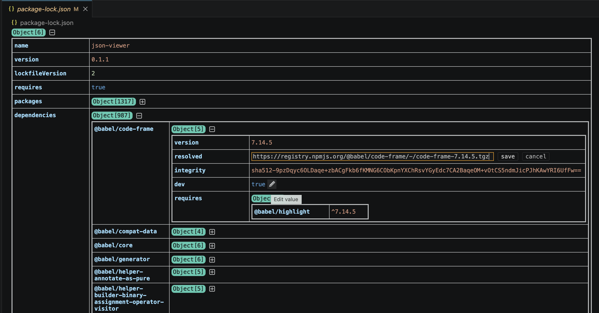

[](http://unmaintained.tech/)
**[DEPRECATED]** Please use https://github.com/greenflute/tiny-grid-viewer

# json-grid-viewer
Cloned from dutchigor:json-grid-viewer, this extension allows you get a better overview of the content in a JSON file by showing it in a resizable grid.
- Columns are resizable.
- Each object and array is collapsed by default but can be expanded to see all contents
- Arrays of objects show in a table format

## Demo


## Usage
To open a json file in the grid viewer, right click the file, select *Open With... > JSON Grid*.

The grid supports:
- inline editing for scalar values
- object key rename
- multiline string editing
- array table/list mode toggle
- resizable columns
- persisted expand state, display mode, and column widths

The editor will display any changes made to the json file live, provided the json is valid.

## Build Extension
```
npm install
npm run build
npm run vscode:prepublish
vsce package
```

## Download VSIX from GitHub
This repository includes a GitHub Actions workflow that builds a `.vsix` package automatically.

### From a GitHub Release
When a GitHub Release is published, the workflow attaches the generated `.vsix` file to the Release assets.
1. Open the repository's **Releases** page.
2. Open the target release.
3. Download the attached `.vsix` file from **Assets**.

## Release Process
To publish a new GitHub Release with a downloadable VSIX:
1. Update the version in `package.json` and `package-lock.json`.
2. Commit and push the version change to GitHub.
3. Create and push a version tag such as `v0.1.2`.
4. Publish a GitHub Release for that tag in the GitHub UI.
5. Wait for the **Build VSIX** workflow to finish; the `.vsix` file will be attached to the Release automatically.

## Note:
- as of Node 20.5.1, consider "export NODE_OPTIONS=--openssl-legacy-provider" before run "npm build", to avoid "Error: error:0308010C:digital envelope routines::unsupported".
- watchout .vscodeignore and use "vsce ls" to check files that will be included in the final package.
